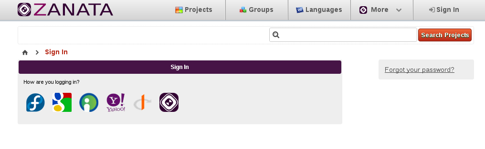
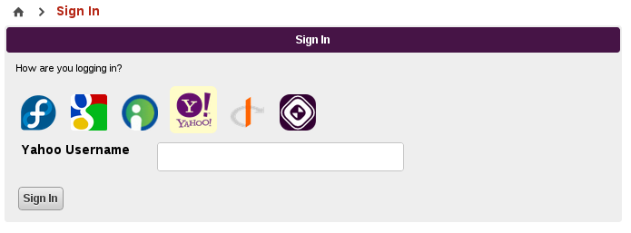

### Logging in with Open Id

Zanata 2.0 now fully supports Open Id. When logging into an Open ID enabled Zanata instance, the user will be presented with an option to log in like this:

By default, Zanata will offer some commonly used Open Id providers (Fedora, Google, My Open Id, and others...) but will also allow for any Open Id provider to be used. By selecting the provider of choice, users can now enter their credentials for authentication.

The user can now be authenticated against the Open Id provider of their choice.

### Adding more Identities

Once a user is logged in, more Identities (i.e. Open Id credentials) can be added to the user's Zanata profile. To do this go to "My Profile", "Manage Identities". There, a list of currently available identities is shown along with some actions. Identities can be deleted, which means that the user will not be able to sign into Zanata with the deleted identity. There must always be at least one Identity available for a user to be able to sign in using Open Id.

To add a new Identity, Zanata will make the user authenticate against the Open Id provider in order to ensure the user actually owns that identity. 

### Merging Identities (Experimental)

Users can merge two accounts together. This is useful when a user has two separate accounts with multiple identities each. To do this, the user must log in, and go to "My Profile", "Merge Accounts". Zanata will ask the user to log into the account before proceeding.

The merged account will be inactivated, with the receiving account inheriting all security permissions. The user will not be able to log into the merged account any longer.