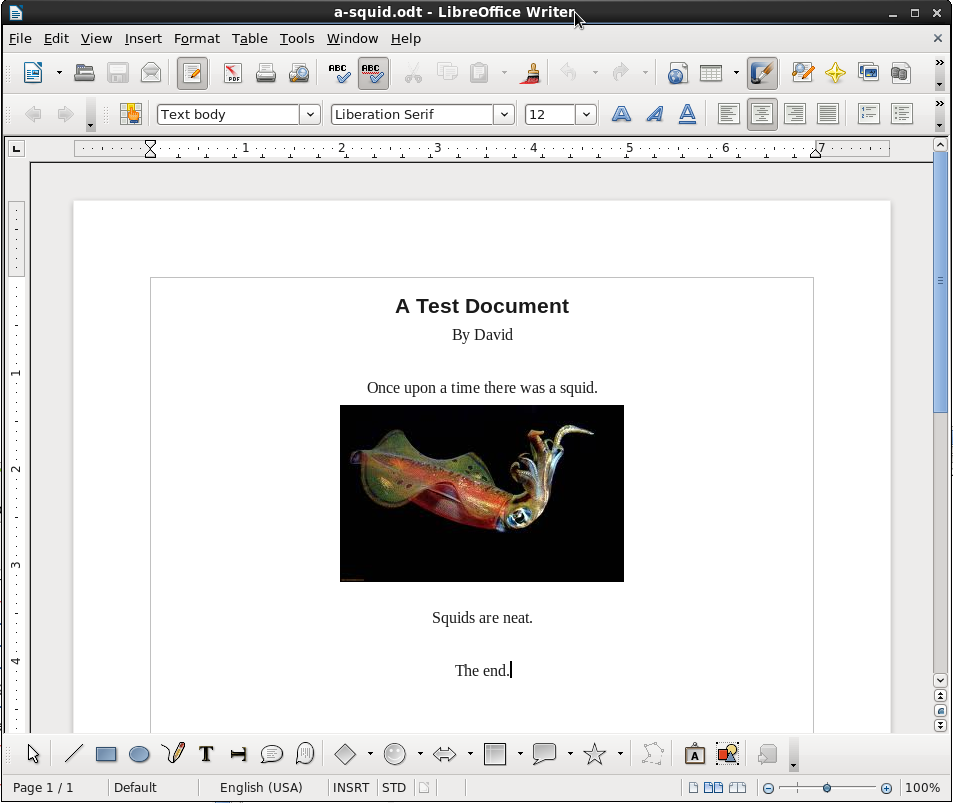
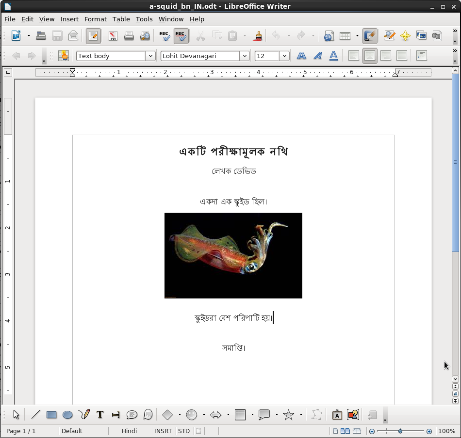

# Uploading and Downloading Raw Documents

In Zanata 2.0 an _experimental_ new feature was added to enable uploading and downloading additional types of documents.

This new feature provides the ability to upload and download documents using the website, the REST interface, the CLI client or the Maven Plugin.

## Supported Formats
Supported formats include:
* plain-text (*.txt)
* Document Type Definition (*.dtd)
* Open Document Format (LibreOffice):
  * Open Document Text (*.odt, *.fodt)
  * Open Document Presentation (*.odp, *.fodp)
  * Open Document Spreadsheet (*.ods, *.fods)
  * Open Document Graphics (*.odg, *.fodg)
* InDesign Markup Language (*.idml)

_Open Document Formula (*.odf) and Open Document Database (*.odb) formats may also work, but have not been tested._

## Known Issues
This is an experimental feature, and several issues exist that should be considered when using this feature:

### Translation Misalignment
Uploading modified versions of existing documents can cause translation misalignment.
For most supported formats, the position of paragraphs is used to identify text flows. If a revised source document is uploaded, one that has a paragraph added or removed (except if it is at the end of the document), then any translations from the position of the paragraph onward will be moved to a different text flow and marked as fuzzy.

_**Workaround:** Upload new versions of a document with a different name, and then use Copy-trans or Translation Memory to copy translations to matching text flows._

### Offline Translation of .po Files ~~Not~~ Supported
~~For most supported formats, offline translation of .po files will not work. When uploading a downloaded .po file, Zanata displays warnings that it cannot match the translations to the source text flows. This is related to a difference in how text flows are identified in different file formats.~~ Offline translation in po format is now supported using 'offlinepo' project type. .po files downloaded from the website as a zip or from a download link will automatically use this format when the maintainer sets the project type to 'File'

_**Workaround:** ~~Use the Zanata web editor to perform the translations, or download and translate the document in the original format.~~ navigate to a project-version on the website, view the documents page for the locale that you want to translate, then download a zip or config file from that page - these will automatically have the project type set to 'offlinepo', which will work with the java-cli client or the maven plugin._

### Offline Translation in the Original Document Format Only Partially Supported
Offline translation in the original document format must have exactly the same layout of the source document. These offline translations will work properly if paragraphs are not rearranged at all. If any paragraphs are added, split or removed, text flows after the affected paragraph will be associated with the wrong source string.

_**Workaround:** Do not change the number of paragraphs or rearrange any paragraphs when doing offline translation. A more reliable solution is to use the Zanata web editor instead of translating offline._

### Source Strings in Translated Documents Are Uploaded as Translations
If you upload a document that is only partially translated, any source strings in the document are treated as approved translations.

_**Workaround:** Only upload translation documents that are completely translated. Alternatively, enter translations in the Zanata web editor to avoid the issue entirely._

## Using the Zanata Web Interface
The following instructions assume you have signed in to the Zanata website and have appropriate permissions for the relevant project or locale. If this is not the case, you will not see the buttons or icons referred to in the instructions.

For illustration purposes, these instructions use a sample .odt document and a translated version as shown here:

### Uploading Source Documents Using the Web Interface
Use the 'Source Documents' page to upload new source documents. Navigate to a project-version and click 'Source Documents' in the 'Actions' box.

* To upload a new document, use the 'Upload Document' button in the 'Actions' box.
* To upload a new version of an existing document, locate the document in the summary table and click the 'Upload' link in the right-hand column.

The dialogue for uploading a source document is similar for both upload methods, with an additional text box for 'path' when uploading a new document. Select the document to be uploaded, ensuring that it has the appropriate file extension as shown in Supported Formats above. For new documents, enter a path or leave the path field blank to have the document at the top level of the project in Zanata. If the document name and path are the same as an existing document in the table, the uploaded document will replace the existing document.
The uploaded file name is only used for new documents, and will be ignored when replacing an existing document.
You can also specify a set of custom parsing parameters that will affect how the source document is parsed after upload. This is an advanced feature. For more information, see [[Custom Document Parameters]].

Documents will appear in the document table upon successful upload. Note path matches the entered value, and document name uses the name of the uploaded file:

### Downloading Source through Web Interface
Source documents can be downloaded from the same page on which they are uploaded (the Source Documents page, see previous section). Look in the 'Download' column in the document table for a link labeled with the raw document file extension. All documents have a .pot download link, but documents with raw data will have another link indicating the original document type (in this case .odt).

### Uploading Translations through Web Interface
Translated documents are uploaded from the 'Documents' page for the relevant locale. Navigate to a project-version and click the icon in the 'Documents' column on the row for the locale of choice. Translated documents should be of the same file format as the raw source document, which is reflected in the document name and the raw download link.

To upload a translated version of a document, locate the document in the summary table and click the 'Upload' icon under the 'Actions' column. A popup is shown with the name of the document at the top and a button to select the translated version of the document. It is recommended to keep the 'Merge?' option selected to avoid losing existing translations.

Upon successful upload, the translation statistics for the document should reflect the addition of the uploaded translations, and the translation strings will be visible in the translation editor:

Please be aware of the current issues with raw translation upload. See 'Known Issues' on this page.

### Downloading Translations through Web Interface
Translated documents can be downloaded from the 'Documents' page for the relevant locale (see previous section). Look in the 'Download' column in the document table for the link labeled with the raw document file extension. All documents have a .po download link, but documents with raw data will have another link indicating the original document type (in this case .odt).

The raw download link will generate a translated document that has the structure of the raw source document, but with source strings replaced with _Approved_ translations for the locale if they are available. For any text flow that does not have an approved translation in Zanata, no substitution is made so the source text will remain.

It is also possible to generate a preview document that has both _Approved_ and _Fuzzy/Needs Review_ translations. Currently there is no link for this 'preview' functionality, so the URL must be modified manually. To do so, copy the normal download link and paste it to the browser address bar, find the part of the URL with '/baked?' and insert 'half-' to make that part '/half-baked?'. Navigate to the modified URL (usually by pressing _Enter_) to download the preview document.

## Instructions for Maven Client
To use 'push' and 'pull' commands with the Zanata Maven Plugin, set the project type to 'raw'. See the detailed help for push and pull commands for additional details.

### Uploading with Maven Client
Check Maven Plugin help for 'push' command.

### Downloading with Maven Client
Check Maven Plugin help for 'pull' command.

## Tips for Translating 'Raw' Documents
### Inline Tags
Some parts of raw documents are not intended for direct translation. These are converted to xml-style inline tags such as "&lt;g1>&lt;g2>&lt;/g2>&lt;/g1>" in the place of the image in the example document. It is recommended that these tags be included in translations with no modifications. The "XML/HTML tags" validator can help detect accidental changes to inline tags. If unsure, you can also download a preview document to ensure that there are no errors or layout problems associated with treatment of tags - see last paragraph of "Downloading Translations through Web Interface"

