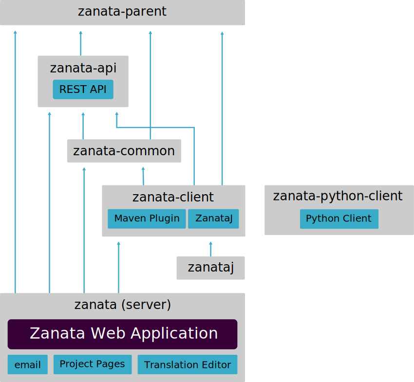

Zanata's source code is divided between several repositories, all of which are available via https://github.com/zanata. This page assumes you are aware of the major components of Zanata, an overview of these is available at [[Architecture]]. For information on setting up a development environment for Zanata, see [[Developer-Guide]].

Most of Zanata uses Maven for dependency and build management, and this page assumes that you are familiar with Maven concepts such as pom. A brief overview of Maven is available at http://maven.apache.org/guides/getting-started/maven-in-five-minutes.html

# Repositories
At the time of writing there are 15 repositories under the Zanata group on github, however  this overview will focus on only 7 of these: zanata-parent, zanata-api, zanata-common, zanata, zanata-client, zanata-python-client and zanataj.

## zanata-parent
This repository simply holds the parent pom inherited by other Zanata modules.

## zanata-api
This repository describes the REST API presented by a Zanata server. It also provides data transfer objects and a service stub that can be used by client applications to easily interact with a Zanata server.

## zanata-common
This repository contains adapters for some of the file types consumed and produced by Zanata, as well as a few utility classes that are required by both client and server components.

## zanata
This repository holds Zanata's main data model and server components, and holds the majority of Zanata's source code.

## zanata-client
This repository holds most of Zanata's client code, including the Zanata Maven Plugin and ZanataJ, but not the python client.

## zanata-python-client
This repository holds the end-of-life Zanata python client, which is to be superseded by ZanataJ.

## zanataj
This repository contains deployment scripts, but none of the application code, for ZanataJ. The application code for ZanataJ can be found in zanata-client/zanata-cli