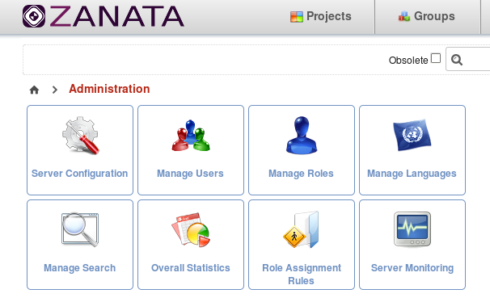
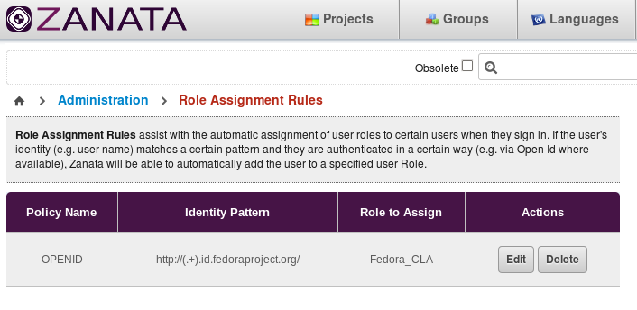
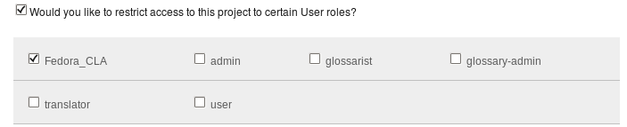

# Role Assignment Rules

'Role assignment rules' are Zanata's way of dynamically assigning security roles and even Project access to users. To configure Role Assignment Rules, admin users must go to the Administration section and select the option below.

### Configuration

Role Assignment Rules have the following fields:

**Policy Name:** This is the type of authentication system that a user logs in with (Open Id, Internal Authentication, etc).

**Identity Pattern:** This is a Regular expression that will be matched against the user's authenticated identity (most of the time this is the user name, but for Open Id, it's the Open Id itself).

**Role To Assign:** This is the Role that will be assigned to the user upon login, if the Policy name and Identity pattern match.

### How it works

1. User Logs in.
2. Authentication Policy is checked. If the user logged in using the authentication policy declared in the rule, continue to the next step. Otherwise, this rule is not applied.
3. Identity Patter is checked. If the user's name (or Open Id) matches the pattern described in the rule, continue to the next step. Otherwise, this rule is not applied.
4. The user is assigned the role stated in the Rule. Process subsequent rules.

### Restricting Project Access to User Roles

To complement the dynamic role assignment described above, Zanata can now restrict project access by roles. To restrict project access, simply edit the project and tick the checkbox asking to "restrict access to the project to certain User roles".

Save the project. Any role restrictions will now be seen on the project's page and only users belonging to that role will be able to work on the project.